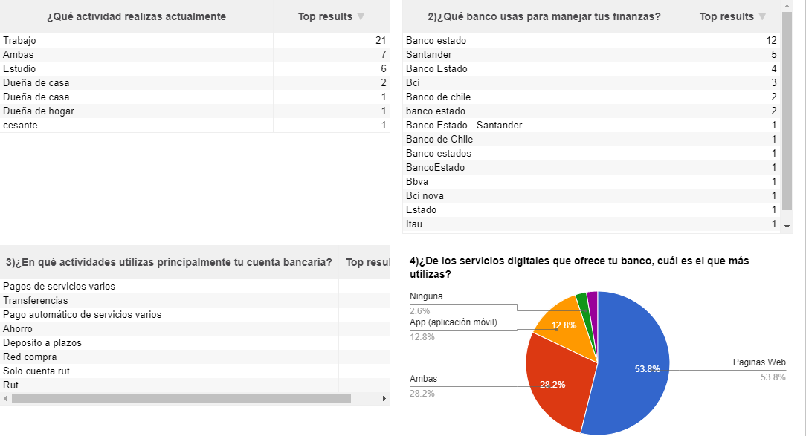
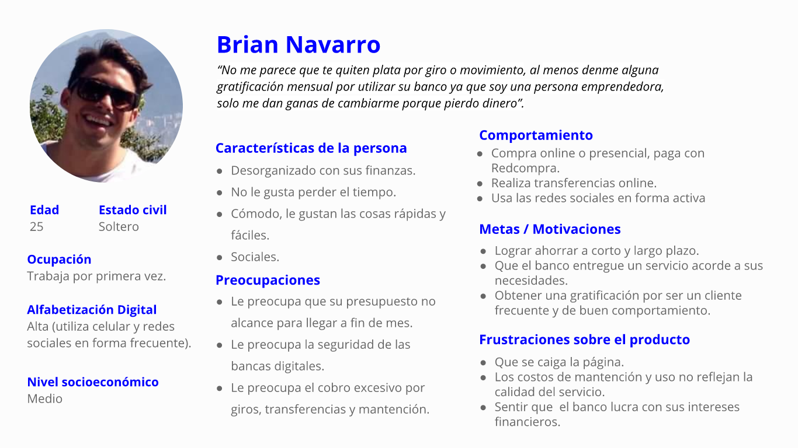
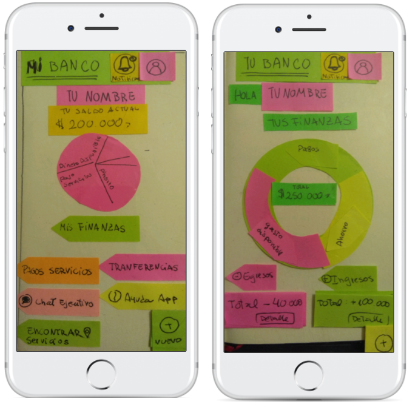
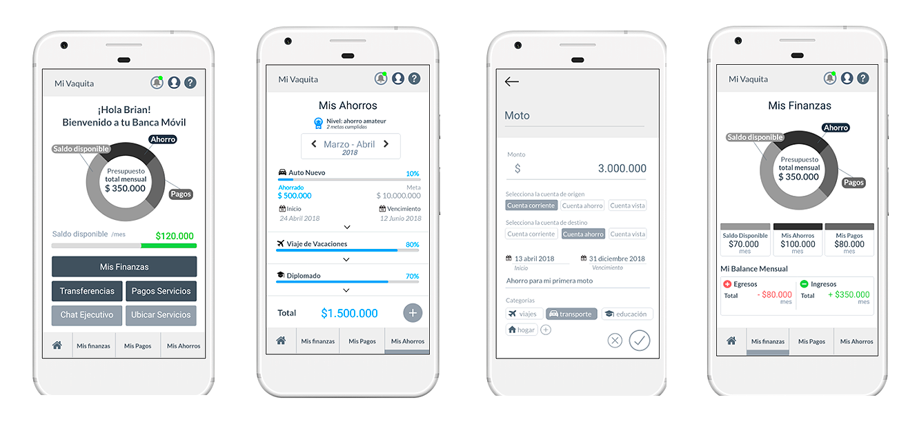

# Mi Vaquita App: propuesta de banca 100% digital para millennials

## Desarrollado para LABORATORIA

## Objetivos

- Diseñar nueva banca 100% digital para milleninnials como un nuevo servicio de un banco ya consolidado.

## ¿Cómo lo hicimos?

- Se desarrolló una solución para App Móvil, que pueda ayudar a los usuarios manejar sus finanzas mediante el ahorro voluntario y planificado, cada vez que se complete un ahorro gana un premio que descuente por un mes los costos asociados a la mantención y así incentivar buenos hábitos en el manejo de finanzas.

## ¿Cómo llegamos a la solución?

## Proceso

**Investigación**
- Realizamos entrevistas en terreno y encuestas online enfocadas a las necesidades de los usuarios jovenes que ocupan el servicio de banca digital.

**Entrevistas en terreno**
- Se entrevistaron a 5 personas. Por cual concluimos que en general todos usan la App móvil bancaria, comentan que es fácil, rápida y útil para revisar sus cuentas en todo lugar.

**Encuestas Online**
- Aprox 39 encuestados.
- Fue respondida en su mayoría por jóvenes de 25 años, la mayoría trabaja y estudia, utilizan Banco estado en especial su servicio de cuenta Rut, la mayoría utiliza la página web, no usan la app por que la encuntran insegura, por desconocimiento y por costumbre de usar la web. Si bien tiene reclamos por el funcionamiento de la plataforma digital en general la evalúan en forma buena con nota 5-6 de 7. Por sobre la seguridad ponen como prioridad mejorar la rapidez y sencillez al usar la plataforma y al momento de elegir un banco optan por el tema de los costos de mantención. La mayoría usa transferencias, pago de servicios y ahorro entre las acciones más frecuentes. Aunque la mayoría utiliza la web del banco, utilizan app móviles frecuentemente, como instagram o youtube, por lo que pensamos que el bajo uso de estos usuarios encuestados es por costumbre no de usar una app móvil.

- Se realizó un mapa de afinidad para encontrar los factores comunes en la problemática. Lo cuales arrojaron que los usuarios sienten que el servicio no refleja el costo asociado, que el banco falta a la necesidad de entregar una buena experiencia a sus usuarios. Consultamos si les gustaría que el banco les ayudará a manejar sus finanzas a lo cual la mayoría contestó que sí, pensamos que es una forma de crear una buena conexión banca-usuarios, la cual comprobaremos al momento de testear nuestro producto.

**Ideación**

- Una vez identificada la principal problematica el "Ahorro" buscamos la mejor manera de hacer sentir la preocupación del banco hacia los usuarios y motivandolos a que ahorren dándoles premios en descuentos por gastos asociados a la mantención de la cuenta por el cumplimiento de sus metas de ahorro.

**User Persona**
- Creamos una user persona para enfocarnos en esta solución y entender mejor a este tipo de usuarios:

**WIREFRAMES**

- Junto al equipo creamos wireframes para alcanzar el objetivo propuesto y suplir las necesidades encontradas en nuestra investigación, dándole al wireframes la funcionalidad necesaria para validarla.

Ver Sketches interactivos
[LINK Sketch MARVELAPP INTERACTIVO ](https://marvelapp.com/8189684)

- Luego creamos el wireframe de alta resolución y lo llevamos a testeo. Del resultado mejoramos pequeños detalles cómo icónos o colores que provocaban confusión en los usuarios.

Ver wireframes de alta resolución
[LINK WIREFRAMES MARVELAPP V.2 ](https://marvelapp.com/40hddj5/screen/39138866)

**Conclusión**

-  Gracias a esta información logramos cumplir el objetivo. Enfocándonos también en la principal problemática de los millennials se desarrollo con éxito el testeo, validando toda la investigación.
